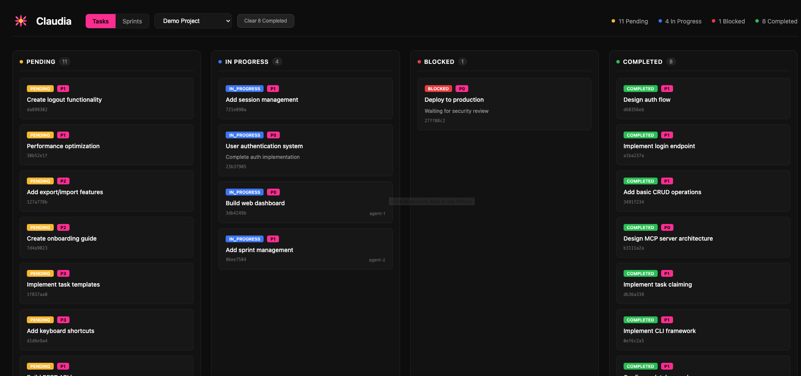
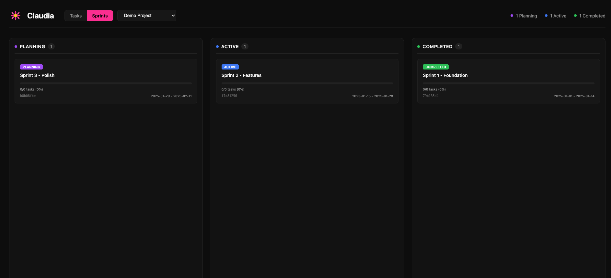

# Claudia

[](https://www.gnu.org/licenses/gpl-3.0)
[](https://bun.sh)
[](https://modelcontextprotocol.io)

**A task management system built for AI agents.**

Claudia provides structured task tracking with a Model Context Protocol (MCP) server, enabling AI assistants like Claude to manage their own work through hierarchical tasks, dependencies, sprints, and acceptance criteria verification.


## Why Claudia?

AI agents need a way to:
- **Track progress** across complex, multi-step tasks
- **Coordinate** when multiple agents work on the same project
- **Remember context** between sessions (64KB JSON storage per task)
- **Verify work** against acceptance criteria before completion
- **Organize work** into sprints and project hierarchies

Claudia provides all of this through both a CLI and MCP server interface.

## Quick Start

```bash
# Install Bun if you haven't already
curl -fsSL https://bun.sh/install | bash

# Clone and build
git clone https://github.com/anthropics/claudia.git
cd claudia
bun install
bun run build

# Initialize and start using
./claudia db init
./claudia task create --title "My first task"
./claudia task list
```

### Try the Demo

See Claudia in action with sample data:

```bash
# Seed demo project with sample tasks and sprints
bun run seed:demo

# Open the web dashboard
./claudia @@ --port 3333
```

Then open http://localhost:3333 in your browser to explore the kanban board and sprint views.

## Screenshots

### Task Board


### Sprint Management


## Features

| Feature | Description |
|---------|-------------|
| **Hierarchical Tasks** | Parent-child relationships with tree visualization |
| **State Machine** | Validated transitions: pending → in_progress → verification → completed |
| **Dependencies** | Block tasks until prerequisites complete, with cycle detection |
| **Sprints** | Group tasks into time-boxed work periods |
| **Multi-Project** | Isolated task namespaces with auto-detection from working directory |
| **Agent Memory** | 64KB JSON context storage per task |
| **Acceptance Criteria** | Define and verify requirements before task completion |
| **Multi-Agent Coordination** | Atomic task claiming, optimistic locking, conflict detection |
| **Web Dashboard** | Visual kanban board with project/sprint filtering |
| **MCP Server** | Drop-in integration with Claude Code and other MCP clients |

## Installation

### Prerequisites

- [Bun](https://bun.sh) runtime (v1.0+)

### From Source

```bash
git clone https://github.com/anthropics/claudia.git
cd claudia
bun install
```

### Build Standalone Binary

```bash
bun run build
# Creates ./claudia binary

# Optional: install globally
cp claudia ~/.bun/bin/
```

## Usage

### CLI Commands

#### Task Management

```bash
# Create a task
claudia task create --title "Implement feature X" --priority p1

# Create with acceptance criteria
claudia task create --title "Add login" --acceptance-criteria "Has email field" --acceptance-criteria "Has password field"

# List tasks
claudia task list
claudia task list --status in_progress --priority p0,p1

# Show task details
claudia task show <task-id>

# Update a task
claudia task update <task-id> --title "New title" --priority p0

# Transition status
claudia task transition <task-id> --to in_progress

# Delete a task
claudia task delete <task-id> --force
```

#### Task Hierarchy

```bash
# Create a subtask
claudia task create --title "Subtask" --parent <parent-id>

# View task tree
claudia task tree              # Full tree
claudia task tree <task-id>    # Subtree from task
```

#### Task Context (Agent Memory)

```bash
# Set context (overwrites)
claudia task context-set <task-id> '{"key": "value"}'

# Merge context (deep merge)
claudia task context-merge <task-id> '{"additional": "data"}'

# Get context
claudia task context-get <task-id>
```

#### Dependencies

```bash
# Add dependency (task depends on blocker)
claudia task depends <task-id> --on <blocker-id>

# Remove dependency
claudia task undepends <task-id> --on <blocker-id>

# Show dependencies
claudia task deps <task-id>

# List blocked tasks
claudia task blocked

# List ready tasks (all deps satisfied)
claudia task ready
```

#### Sprints

```bash
# Create a sprint
claudia sprint create --name "Sprint 1" --start 2024-01-15 --end 2024-01-29

# List sprints
claudia sprint list

# Show sprint with tasks
claudia sprint show <sprint-id>

# Activate a sprint
claudia sprint activate <sprint-id>
```

#### Projects

```bash
# Create a project
claudia project create --name "My Project" --path /path/to/project

# List projects
claudia project list

# Select active project
claudia project select <project-id>

# Show current project
claudia project current
```

### Web Dashboard

```bash
# Open dashboard in browser
claudia @@

# Custom port
claudia @@ --port 8080
```

The dashboard provides:
- **Tasks View**: Kanban board with drag-and-drop columns
- **Sprints View**: Sprint cards with progress indicators
- **Project Filter**: Scope views to specific projects
- **Clear Completed**: Archive finished tasks

### MCP Server Integration

Start the MCP server for use with Claude Code:

```bash
claudia mcp
```

#### Claude Code Configuration

Add to `.mcp.json` in your project root:

```json
{
  "mcpServers": {
    "claudia": {
      "command": "/path/to/claudia",
      "args": ["mcp"]
    }
  }
}
```

Or for development (without building):

```json
{
  "mcpServers": {
    "claudia": {
      "command": "bun",
      "args": ["run", "/path/to/claudia/src/mcp/server.ts"],
      "cwd": "/path/to/claudia"
    }
  }
}
```

After adding the config, restart Claude Code to connect.

#### Available MCP Tools

**Compound Operations** (Recommended for agents)

| Tool | Description |
|------|-------------|
| `task_start` | Create and start a task in one operation |
| `task_finish` | Complete a task with optional summary |
| `task_workspace` | Get current agent's workspace context |
| `task_handoff` | Transfer task to another agent |
| `task_abandon` | Release task back to pending |

**Task Management**

| Tool | Description |
|------|-------------|
| `task_create` | Create a new task |
| `task_read` | Get task by ID |
| `task_update` | Update task fields |
| `task_delete` | Delete a task |
| `task_list` | Query tasks with filters |
| `task_transition` | Change task status |
| `task_tree` | Get hierarchical task view |

**Coordination**

| Tool | Description |
|------|-------------|
| `task_claim` | Atomically claim a task |
| `task_release` | Release a claimed task |
| `task_blocked` | List blocked tasks |
| `task_ready` | List ready tasks |
| `task_dependency_add` | Add task dependency |

**Verification**

| Tool | Description |
|------|-------------|
| `task_verify` | Mark criterion as verified |
| `task_verification_status` | Get verification progress |

See the [full MCP tools reference](#mcp-tools-reference) below for complete documentation.

## Task Workflow

```
┌─────────┐     ┌─────────────┐     ┌──────────────┐     ┌───────────┐
│ pending │────▶│ in_progress │────▶│ verification │────▶│ completed │
└─────────┘     └─────────────┘     └──────────────┘     └───────────┘
     │                │                    │                    │
     ▼                ▼                    ▼                    ▼
┌─────────┐                         ┌──────────┐
│ blocked │                         │ archived │ (terminal)
└─────────┘                         └──────────┘
```

**Valid transitions:**
- `pending` → `in_progress`, `blocked`, `archived`
- `in_progress` → `pending`, `verification`, `completed`, `blocked`, `archived`
- `verification` → `in_progress`, `completed`, `blocked`, `archived`
- `blocked` → `pending`, `in_progress`, `archived`
- `completed` → `in_progress`, `archived`
- `archived` → (terminal state)

Tasks can skip `verification` if no acceptance criteria are defined.

## Multi-Agent Coordination

Claudia supports multiple AI agents working concurrently on the same project.

### Task Claiming

```typescript
// Claim before working
const result = await task_claim({ task_id: "uuid", agent_id: "agent-1" });
if (result.success) {
  // Task is yours - proceed
} else {
  // Already claimed by another agent
}

// Release when done or on failure
await task_release({ task_id: "uuid", agent_id: "agent-1" });
```

### Optimistic Locking

```typescript
// Read task first
const task = await task_read({ id: "uuid" });

// Update with version check
await task_update({
  id: task.id,
  title: "Updated",
  version: task.version  // Fails if modified by another agent
});
```

### Recommended Pattern

1. `task_ready` - List tasks with satisfied dependencies
2. `task_claim` - Atomically reserve a task
3. `task_transition` - Move to `in_progress`
4. `task_context_merge` - Save progress
5. `task_transition` - Move to `completed`
6. On failure: `task_release` - Let another agent retry

## Configuration

| Environment Variable | Description | Default |
|---------------------|-------------|---------|
| `CLAUDIA_DB` | Database file path | `~/.claudia/tasks.db` |

## Development

```bash
# Development mode
bun run dev

# Run tests
bun test

# Type checking
bun run typecheck
```

## Exit Codes

| Code | Meaning |
|------|---------|
| 0 | Success |
| 1 | General error |
| 2 | Resource not found |
| 3 | Conflict (version mismatch) |
| 4 | Validation error |
| 5 | Storage error |

## MCP Tools Reference

<details>
<summary><strong>Compound Operations</strong></summary>

#### task_start
Create and start a task in one operation. Auto-claims for the current agent.

```json
{
  "title": "Task title",
  "description": "Optional description",
  "priority": "p0|p1|p2|p3",
  "parent_id": "optional-parent-uuid",
  "acceptance_criteria": ["criterion 1", "criterion 2"]
}
```

#### task_finish
Complete a task with optional summary.

```json
{
  "id": "task-uuid",
  "summary": "Optional completion summary"
}
```

#### task_workspace
Get current agent's workspace context including claimed tasks.

```json
{
  "include_completed": false
}
```

#### task_handoff
Transfer task to another agent.

```json
{
  "task_id": "task-uuid",
  "to_agent_id": "target-agent",
  "notes": "Optional handoff notes"
}
```

#### task_abandon
Release task back to pending with reason.

```json
{
  "task_id": "task-uuid",
  "reason": "Why abandoning"
}
```

</details>

<details>
<summary><strong>Task CRUD</strong></summary>

#### task_create
```json
{
  "title": "Required title",
  "description": "Optional",
  "status": "pending",
  "priority": "p0|p1|p2|p3",
  "parent_id": "uuid",
  "sprint_id": "uuid",
  "tags": ["tag1", "tag2"],
  "assignee": "name",
  "acceptance_criteria": ["criterion"]
}
```

#### task_read
```json
{ "id": "task-uuid" }
```

#### task_update
```json
{
  "id": "task-uuid",
  "title": "New title",
  "version": 1
}
```

#### task_delete
```json
{ "id": "task-uuid" }
```

#### task_list
```json
{
  "status": ["pending", "in_progress"],
  "priority": ["p0", "p1"],
  "parent_id": "uuid",
  "sprint_id": "uuid",
  "assignee": "name",
  "limit": 100,
  "offset": 0
}
```

#### task_transition
```json
{
  "id": "task-uuid",
  "to": "in_progress"
}
```

#### task_tree
```json
{
  "id": "optional-root-uuid",
  "depth": 5
}
```

</details>

<details>
<summary><strong>Bulk Operations</strong></summary>

#### task_create_many
```json
{
  "tasks": [
    { "title": "Task 1" },
    { "title": "Task 2" }
  ],
  "parent_id": "optional-common-parent",
  "sprint_id": "optional-common-sprint"
}
```

#### task_update_many
```json
{
  "ids": ["uuid1", "uuid2"],
  "updates": {
    "priority": "p1",
    "assignee": "agent-1"
  }
}
```

#### task_transition_many
```json
{
  "ids": ["uuid1", "uuid2"],
  "to": "completed",
  "skip_invalid": true
}
```

</details>

<details>
<summary><strong>Dependencies & Coordination</strong></summary>

#### task_dependency_add
```json
{
  "task_id": "blocked-task",
  "depends_on_id": "blocking-task"
}
```

#### task_dependency_remove
```json
{
  "task_id": "task-uuid",
  "depends_on_id": "dependency-uuid"
}
```

#### task_dependencies
```json
{ "task_id": "task-uuid" }
```

#### task_blocked
List all tasks with unsatisfied dependencies.

#### task_ready
List all tasks ready to work on (dependencies satisfied).

#### task_claim
```json
{
  "task_id": "task-uuid",
  "agent_id": "claiming-agent"
}
```

#### task_release
```json
{
  "task_id": "task-uuid",
  "agent_id": "releasing-agent"
}
```

</details>

<details>
<summary><strong>Context Storage</strong></summary>

#### task_context_set
Overwrite task context (max 64KB).
```json
{
  "id": "task-uuid",
  "context": { "any": "json data" }
}
```

#### task_context_merge
Deep merge into existing context.
```json
{
  "id": "task-uuid",
  "context": { "additional": "data" }
}
```

#### task_context_get
```json
{ "id": "task-uuid" }
```

</details>

<details>
<summary><strong>Verification</strong></summary>

#### task_verify
Mark an acceptance criterion as verified.
```json
{
  "task_id": "task-uuid",
  "criterion_id": "criterion-uuid",
  "evidence": "Optional verification evidence"
}
```

#### task_verification_status
Get verification progress for a task.
```json
{ "task_id": "task-uuid" }
```

</details>

<details>
<summary><strong>Sprints</strong></summary>

#### sprint_create
```json
{
  "name": "Sprint 1",
  "start_at": "2024-01-15",
  "end_at": "2024-01-29"
}
```

#### sprint_list
```json
{ "include_archived": false }
```

#### sprint_show
```json
{ "id": "sprint-uuid" }
```

#### sprint_update
```json
{
  "id": "sprint-uuid",
  "name": "New name",
  "status": "active"
}
```

#### sprint_delete
```json
{ "id": "sprint-uuid" }
```

#### sprint_activate
```json
{ "id": "sprint-uuid" }
```

</details>

<details>
<summary><strong>Projects</strong></summary>

#### project_create
```json
{
  "name": "Project name",
  "description": "Optional",
  "path": "/optional/directory/path"
}
```

#### project_list
List all projects.

#### project_read
```json
{ "id": "project-uuid" }
```

#### project_update
```json
{
  "id": "project-uuid",
  "name": "New name"
}
```

#### project_delete
```json
{ "id": "project-uuid" }
```

#### project_select
```json
{ "id": "project-uuid" }
```

#### project_current
```json
{ "cwd": "/optional/path/for/autodetect" }
```

</details>

## Contributing

We welcome contributions! Please see [CONTRIBUTING.md](CONTRIBUTING.md) for guidelines.

## License

GPLv3 - see [LICENSE](LICENSE) for details.
